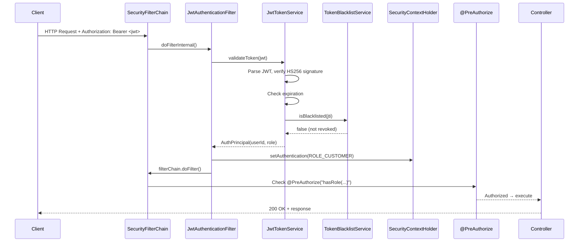

# Authentication & Security Architecture

This document describes the authentication, authorization, and security architecture of the Smart E-Commerce Security project.

---

## High-Level Summary

| Layer | Technology | Responsibility |
|-------|-----------|----------------|
| **Authentication** | Spring Security `SecurityFilterChain` + `JwtAuthenticationFilter` | Validates JWT Bearer tokens on every request |
| **Authorization** | `@PreAuthorize` / `@Secured` (method security) | Role-based access control (ADMIN, CUSTOMER) |
| **Password hashing** | BCrypt (`BCryptPasswordEncoder`) | Secure password storage |
| **Token generation** | JJWT (HMAC-SHA256) | Signed JWT with claims (sub, role, iat, exp, jti) |
| **Token revocation** | `TokenBlacklistService` (ConcurrentHashMap) | O(1) lookup for revoked tokens |
| **OAuth2** | Spring Security OAuth2 Client (Google) | Social login with automatic user provisioning |
| **CSRF** | Disabled for `/api/**` and `/graphql`; enabled for `/csrf-demo` | Stateless JWT endpoints don't need CSRF; form demo shows it |
| **CORS** | Consolidated in `SecurityConfig.corsConfigurationSource()` | Allows specific frontend origins |
| **Audit logging** | `SecurityEventListener` + `TokenActivityService` | Tracks auth events, token usage, and access patterns |

---

## Components and Responsibilities

### SecurityConfig
- **File:** `config/SecurityConfig.java`
- Defines the `SecurityFilterChain` bean with all security policies.
- Registers the `JwtAuthenticationFilter` before `UsernamePasswordAuthenticationFilter`.
- Configures CSRF (disabled for APIs, enabled for forms), CORS, session management (STATELESS), and endpoint authorization rules.
- Enables `@PreAuthorize` / `@Secured` via `@EnableMethodSecurity`.

### JwtAuthenticationFilter
- **File:** `domain/auth/filter/JwtAuthenticationFilter.java`
- `OncePerRequestFilter` that extracts the `Authorization: Bearer <token>` header.
- Delegates to `TokenService.validateToken()` for JWT verification.
- On success: populates `SecurityContextHolder` with `UsernamePasswordAuthenticationToken` carrying `ROLE_<role>` authorities.
- On failure: logs the attempt and lets the request continue (Spring Security will reject if endpoint requires authentication).

### JwtTokenService
- **File:** `domain/auth/service/impl/JwtTokenService.java`
- Implements `TokenService` interface.
- **Generation:** Creates signed JWTs with claims: `sub` (userId), `role`, `iat`, `exp`, `jti` (unique token ID).
- **Validation:** Parses and verifies the signature (HMAC-SHA256), checks expiry, checks blacklist.
- **Algorithm:** HMAC-SHA256 (HS256) — a symmetric hashing algorithm providing tamper-proof signatures.

### TokenBlacklistService
- **File:** `domain/auth/service/TokenBlacklistService.java`
- In-memory `ConcurrentHashMap<String, Instant>` storing revoked token JTIs.
- **DSA concept:** O(1) HashMap lookup for blacklist checks; O(1) insert for revocation.
- Scheduled cleanup every 15 minutes removes expired entries to prevent unbounded memory growth.
- In production, this would be backed by Redis with TTL.

### TokenActivityService
- **File:** `domain/auth/service/TokenActivityService.java`
- Tracks token generation, validation, and revocation events in-memory.
- Provides `TokenUsageStats` (active token count, total validations) for the admin security report.

### CustomUserDetailsService
- **File:** `domain/auth/service/impl/CustomUserDetailsService.java`
- Implements Spring Security `UserDetailsService`.
- Loads users from the database by email for credential-based authentication.
- Returns `UserDetails` with `ROLE_<role>` authorities.

### CustomOAuth2UserService
- **File:** `domain/auth/service/impl/CustomOAuth2UserService.java`
- Extends `DefaultOAuth2UserService` for Google OAuth2 login.
- After successful Google authentication: looks up or creates the user in the database.
- New OAuth2 users are assigned the `CUSTOMER` role by default.

### OAuth2AuthenticationSuccessHandler
- **File:** `domain/auth/handler/OAuth2AuthenticationSuccessHandler.java`
- After successful OAuth2 login, generates a JWT and returns it as a JSON response.
- Bridges the OAuth2 flow into the JWT-based API authentication model.

### AuthController
- **File:** `domain/auth/controller/AuthController.java`
- **POST /api/auth/login** — Authenticates via `AuthenticationManager`, returns JWT.
- **POST /api/auth/register** — Creates user via `UserService`, returns JWT.
- **POST /api/auth/logout** — Extracts JTI from token, adds to blacklist.

### SecurityEventListener
- **File:** `config/SecurityEventListener.java`
- Listens to Spring Security events: `AuthenticationSuccessEvent`, `AuthenticationFailureBadCredentialsEvent`, `AuthorizationDeniedEvent`.
- Maintains atomic counters and a bounded buffer (100 entries) of recent security events.
- Data consumed by `SecurityReportService` for admin audit reports.

### SecurityReportController / SecurityReportService
- **Files:** `domain/auth/controller/SecurityReportController.java`, `domain/auth/service/SecurityReportService.java`
- **GET /api/admin/security-report** — Admin-only endpoint returning authentication statistics, token metrics, and recent security events.

### PasswordConfig
- **File:** `config/PasswordConfig.java`
- Exposes `BCryptPasswordEncoder` as a Spring bean.
- BCrypt applies adaptive hashing (salt + cost factor) for secure password storage.

---

## Request Flow (JWT Authentication)

```
1. Client sends:  GET /api/orders  |  Authorization: Bearer <jwt>
                         │
2. JwtAuthenticationFilter.doFilterInternal()
   ├── Extract token from "Authorization: Bearer ..." header
   ├── Call tokenService.validateToken(token)
   │   ├── Parse JWT, verify HMAC-SHA256 signature
   │   ├── Check expiration
   │   ├── Check blacklist (ConcurrentHashMap O(1) lookup)
   │   └── Return AuthPrincipal(userId, role)
   ├── Create UsernamePasswordAuthenticationToken with ROLE_<role>
   ├── Set SecurityContextHolder.getContext().setAuthentication(...)
   └── Continue filter chain
                         │
3. Spring Security authorization:
   ├── URL-based rules (SecurityConfig.authorizeHttpRequests)
   └── Method-level @PreAuthorize("hasRole('ADMIN')") on controller
                         │
4. Controller executes → returns response
```

## Request Flow (Login)

```
1. Client sends:  POST /api/auth/login  { "email": "...", "password": "..." }
                         │
2. AuthController.authenticate()
   ├── AuthenticationManager.authenticate(UsernamePasswordAuthenticationToken)
   │   ├── DaoAuthenticationProvider
   │   │   ├── CustomUserDetailsService.loadUserByUsername(email)
   │   │   └── BCryptPasswordEncoder.matches(password, hash)
   │   └── On success: AuthenticationSuccessEvent → SecurityEventListener
   ├── Look up User entity to get ID and role
   ├── TokenService.generateToken(userId, role) → signed JWT
   ├── TokenActivityService.logTokenGeneration(...)
   └── Return { userId, role, token }
```

## Request Flow (Google OAuth2)

```
1. Client redirects to:  /oauth2/authorization/google
                         │
2. Spring Security OAuth2 → Google authorization server
                         │
3. Google callback → CustomOAuth2UserService.loadUser()
   ├── Fetch user info from Google API
   ├── Find or create user in database
   └── Assign CUSTOMER role to new users
                         │
4. OAuth2AuthenticationSuccessHandler.onAuthenticationSuccess()
   ├── Generate JWT for the user
   └── Return JSON { userId, role, token, email }
```

---

## Role-Based Access Control (RBAC)

### Roles
| Role | Description |
|------|-------------|
| `ADMIN` | Full access to all endpoints and management operations |
| `CUSTOMER` | Access to own profile, cart, orders, and reviews |

### Endpoint Security Matrix

| Endpoint | Public | CUSTOMER | ADMIN |
|----------|--------|----------|-------|
| `POST /api/auth/login` | ✅ | ✅ | ✅ |
| `POST /api/auth/register` | ✅ | ✅ | ✅ |
| `GET /api/products/**` | ✅ | ✅ | ✅ |
| `GET /api/categories/**` | ✅ | ✅ | ✅ |
| `POST /api/products` | ❌ | ❌ | ✅ |
| `GET /api/users` | ❌ | ❌ | ✅ |
| `GET /api/orders` (all) | ❌ | ❌ | ✅ |
| `POST /api/orders` | ❌ | ✅ | ✅ |
| `POST /api/reviews` | ❌ | ✅ | ✅ |
| `GET /api/admin/security-report` | ❌ | ❌ | ✅ |
| `/csrf-demo` | ✅ | ✅ | ✅ |

### How RBAC is Enforced
1. **URL-based:** `SecurityConfig.authorizeHttpRequests()` defines coarse-grained rules.
2. **Method-based:** `@PreAuthorize("hasRole('ADMIN')")` on controller/resolver methods for fine-grained control.
3. **Defense-in-depth:** Both layers are active — even if a URL rule is misconfigured, method security provides a safety net.

---

## CSRF and CORS Configuration

### CSRF
- **Disabled** for `/api/**` and `/graphql` — these are stateless JWT endpoints; browsers don't auto-attach the `Authorization` header, so CSRF attacks are not applicable.
- **Enabled** for `/csrf-demo` — demonstrates CSRF protection for traditional HTML form submissions using `CookieCsrfTokenRepository`.
- **When to enable CSRF:** Any endpoint using cookie/session-based authentication with HTML forms.

### CORS
- Configured in `SecurityConfig.corsConfigurationSource()`.
- Allowed origins: `localhost:3000` (React), `localhost:4200` (Angular), `localhost:5173` (Vite), `localhost:8080` (same-origin/JavaFX).
- Allowed methods: GET, POST, PUT, PATCH, DELETE, OPTIONS.
- Credentials allowed (for cookie-based flows like OAuth2 redirects).
- Unauthorized origins receive no `Access-Control-Allow-Origin` header — the browser blocks the response.

---

## DSA Concepts Applied

| Concept | Where Applied | Benefit |
|---------|---------------|---------|
| **Hashing (HMAC-SHA256)** | JWT signature in `JwtTokenService` | Tamper-proof tokens; O(1) verification |
| **Hashing (BCrypt)** | Password storage via `BCryptPasswordEncoder` | Adaptive cost factor; salt prevents rainbow tables |
| **HashMap (ConcurrentHashMap)** | `TokenBlacklistService` for revoked tokens | O(1) insert and lookup for blacklist checks |
| **HashMap (ConcurrentHashMap)** | `TokenActivityService` for active token tracking | O(1) token activity updates |
| **Deque (ConcurrentLinkedDeque)** | `SecurityEventListener` recent events buffer | O(1) insert/remove; bounded at 100 entries |
| **AtomicLong counters** | `SecurityEventListener` auth event counting | Lock-free thread-safe counting |

---

## Sequence Diagram



---

## Files Overview

| File | Purpose |
|------|---------|
| `config/SecurityConfig.java` | Central security filter chain, CSRF, CORS, session policy |
| `config/PasswordConfig.java` | BCryptPasswordEncoder bean |
| `config/SecurityEventListener.java` | Auth event logging, counters, recent events buffer |
| `domain/auth/filter/JwtAuthenticationFilter.java` | JWT extraction and SecurityContext population |
| `domain/auth/service/TokenService.java` | Token interface (generateToken, validateToken) |
| `domain/auth/service/impl/JwtTokenService.java` | JWT implementation (HMAC-SHA256, JJWT) |
| `domain/auth/service/TokenBlacklistService.java` | In-memory token revocation (ConcurrentHashMap) |
| `domain/auth/service/TokenActivityService.java` | Token usage tracking and statistics |
| `domain/auth/service/SecurityReportService.java` | Aggregates security metrics for admin report |
| `domain/auth/service/impl/CustomUserDetailsService.java` | Loads users from DB for Spring Security |
| `domain/auth/service/impl/CustomOAuth2UserService.java` | Google OAuth2 user provisioning |
| `domain/auth/handler/OAuth2AuthenticationSuccessHandler.java` | Issues JWT after OAuth2 login |
| `domain/auth/controller/AuthController.java` | Login, register, logout endpoints |
| `domain/auth/controller/SecurityReportController.java` | Admin security audit report |
| `domain/auth/controller/CsrfDemoController.java` | CSRF token demonstration (Thymeleaf) |

---

## Security Hardening Notes

1. **JWT secret:** Use a strong, randomly generated secret (≥256 bits). Store in environment variables, never in source code.
2. **Token expiry:** Default 24 hours. Consider shorter expiry + refresh tokens for sensitive operations.
3. **Blacklist store:** Current implementation is in-memory (single instance). For multi-instance deployments, migrate to Redis with TTL matching JWT expiry.
4. **OAuth2 secrets:** Google client ID/secret must be stored securely (environment variables or secrets manager).
5. **Rate limiting:** Consider adding rate limiting to `/api/auth/login` to mitigate brute-force attacks (use the failure count from `SecurityEventListener` as a signal).
6. **HTTPS:** Always deploy behind TLS in production to protect Bearer tokens in transit.

